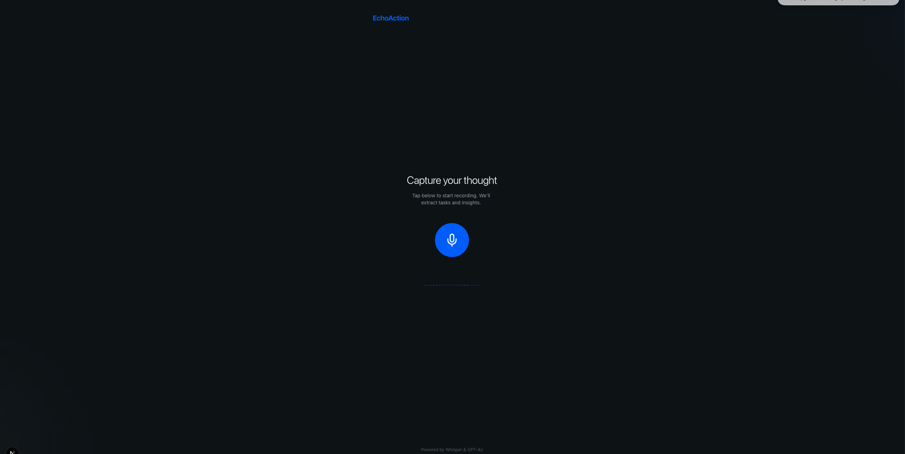

# EchoAction

**EchoAction** is a powerful voice-to-action application that transforms your spoken thoughts into organized tasks and insights. It records your voice, visualizes the audio in real-time, transcribes it with high accuracy, and uses advanced AI to extract actionable items.

 <!-- Replace with actual screenshot if available -->

## Features

- **Real-time Audio Visualizer**: Beautiful, responsive visualizations while you record.
- **Instant Transcription**: Powered by **Groq** (Whisper Large v3) for lightning-fast speech-to-text.
- **AI Intelligence**: Uses LLMs (via **OpenAI/OpenRouter**) to analyze transcripts and extract:
    - **Tasks** with priority, due dates, and assignees.
    - **Insights** and key takeaways.
- **Modern UI**: Built with **Next.js 15**, **Tailwind CSS v4**, and **Framer Motion** for a premium, fluid experience.
- **Monorepo Structure**: Unified frontend and backend management.

## Tech Stack

### Frontend
- **Framework**: [Next.js 15](https://nextjs.org/) (App Router)
- **Styling**: [Tailwind CSS v4](https://tailwindcss.com/)
- **Animations**: [Framer Motion](https://www.framer.com/motion/)
- **State Management**: [Zustand](https://github.com/pmndrs/zustand)
- **Icons**: [Lucide React](https://lucide.dev/)

### Backend
- **Server**: [Express.js](https://expressjs.com/)
- **AI/ML**: 
    - [Groq SDK](https://groq.com/) (Whisper for transcription)
    - [OpenAI SDK](https://platform.openai.com/docs/libraries/node-os-library) (Action extraction)
- **File Handling**: [Multer](https://github.com/expressjs/multer)

## Getting Started

Follow these steps to get the project running locally.

### Prerequisites
- Node.js 18+ installed.
- API Keys for **Groq** and **OpenAI** (or OpenRouter).

### Installation

1.  **Clone the repository**:
    ```bash
    git clone https://github.com/yourusername/voice-memo.git
    cd voice-memo
    ```

2.  **Install dependencies**:
    We have a convenience script to install dependencies for both root, frontend, and backend.
    ```bash
    npm run install:all
    ```

### Configuration

1.  **Backend Environment Variables**:
    Create a `.env` file in the `backend/` directory:
    ```bash
    cp backend/.env.example backend/.env # If example exists, otherwise create new
    ```
    Add your keys:
    ```env
    PORT=3001
    GROQ_API_KEY=gsk_...
    OPENAI_API_KEY=sk-... 
    # If using OpenRouter/Gemini:
    # OPENAI_BASE_URL=https://openrouter.ai/api/v1
    # LLM_MODEL=google/gemini-2.0-flash-001
    ```

2.  **Frontend Environment Variables** (Optional):
    Create a `.env.local` in `frontend/` if you have specific frontend config, though currently it defaults to localhost:3001.

### Running the App

Start the entire development stack (Frontend + Backend) with a single command from the **root** directory:

```bash
npm run dev
```

- **Frontend**: [http://localhost:3000](http://localhost:3000)
- **Backend**: [http://localhost:3001](http://localhost:3001)

## Project Structure

```
voice-memo/
├── package.json        # Root scripts (dev, install:all)
├── backend/            # Express server & AI processing
│   ├── server.js       # Main application entry
│   ├── uploads/        # Temp audio storage
│   └── package.json
└── frontend/           # Next.js application
    ├── app/            # App Router pages and layout
    ├── components/     # UI Components (AudioVisualizer, etc.)
    ├── store/          # Zustand state management
    └── package.json
```

## Contributing

Contributions are welcome! Please feel free to submit a Pull Request.
